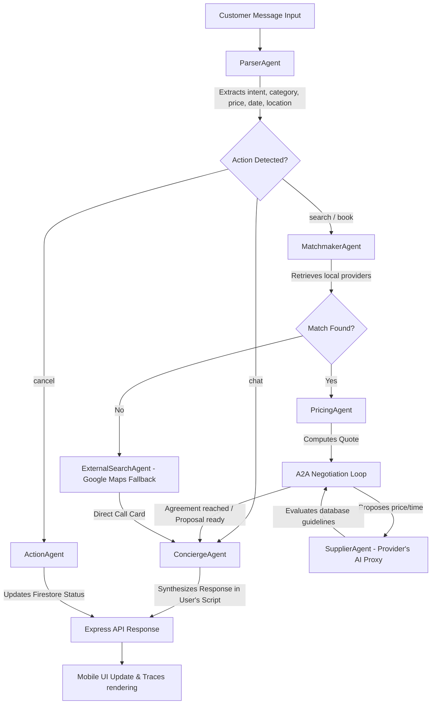

# 🌐 Wasila — AI-Powered Service Booking Platform

> **Hackathon Submission | Multi-Agent AI System with Real-Time A2A Negotiation (Challenge 2)**

[](https://wasila-backend-de239.us-central1.run.app)
[](https://openrouter.ai)
[](https://firebase.google.com)
[](https://expo.dev)

---

## 🧭 Overview

**Wasila** is a multilingual, AI-driven mobile platform designed specifically for the **informal service economy** of Pakistan. It connects daily-wage service providers (plumbers, electricians, AC technicians, tutors, etc.) with local customers through an intelligent multi-agent system. 

Unlike traditional gig-economy apps, Wasila features **real-time Agent-to-Agent (A2A) negotiation** — where a customer-side agent negotiates the booking price, date, and requirements directly with a personalized AI agent representing the service provider in milliseconds.

---

## 🎯 The Problem & The AI Solution (Challenge 2)

Our project directly addresses **Challenge 2: AI Service Orchestrator (Informal Economy)**, which focuses on automating and streamlining service bookings for local laborers.

### 1. Inefficient Price Discovery & Bargaining Friction
*   **The Problem:** In developing markets like Pakistan, bargaining is cultural. Customers refuse to accept flat rates, and service providers have variable rates depending on location and timing. Traditional apps (like TaskRabbit) force static pricing, causing booking drop-offs due to manual negotiations over phone calls.
*   **The AI Solution:** Wasila implements a real-time **Agent-to-Agent (A2A) Negotiation Loop**. The customer can bargain in plain text, and the provider's agent checks personalized rules in Firestore (e.g., *"minimum Rs. 1,200 for AC cleaning"*) to negotiate, counter-offer, or accept the booking within a fraction of a second.

### 2. Literacy & Language Barriers (Roman Urdu / Nastaliq)
*   **The Problem:** Most local service providers and many customers cannot read or write English fluely. They communicate using Roman Urdu (Urdu written in English alphabets like *"nalka kharab hai"*) or Urdu Nastaliq script. Traditional apps only offer static English/Urdu translation dropdowns, which feel rigid and unnatural.
*   **The AI Solution:** Wasila features **native colloquial script-matching**. The platform auto-detects the script (Roman Urdu, Nastaliq, or English) and replies in the exact same format. The AI understands localized slang (e.g., *"nalka toot gaya"* -> Plumber; *"dhakka lagana"* -> Car mechanic).

### 3. Category & Location Desynchronization
*   **The Problem:** Standard search filters are brittle. If a user describes a plumbing problem in detail without choosing "Plumber" from a list, the app fails to match. Similarly, if a user searches for an electrician in "Islamabad Markaz" but the provider is listed in "Rawalpindi", the matchmaker fails to resolve the geographic proximity.
*   **The AI Solution:** Our **ParserAgent** handles conversational semantic extraction, converting colloquial descriptions into concrete categories, and our **MatchmakerAgent** uses LLM reasoning to evaluate location proximity (rejecting cross-city providers but intelligently pairing nearby sectors).

### 4. Scheduling & Immediate Follow-up Reminders
*   **The Problem:** Informal workers often forget bookings or fail to arrive on time due to a lack of calendar tools. 
*   **The AI Solution:** Wasila integrates a background **Reminders Engine** (`/api/reminders`) that runs scheduled audits of active bookings and simulates real-time native push notifications via Firestore listeners.

---

## 🌟 The AI "Wow Factors"

Wasila is equipped with several premium features that showcase the power of agentic AI systems:

### 🤝 Real-Time A2A Bargaining Loop
The customer proposes a booking with a price (e.g., "Rs. 1,000 for electrical wiring"). Instead of waiting hours for the provider to wake up and reply, the provider's AI proxy (**SupplierAgent**) immediately evaluates the offer against the provider's database rules. If the rules state a minimum of Rs. 1,200, the AI counters with Rs. 1,200. This multi-turn negotiation takes place in milliseconds.

### 💬 Colloquial Pakistani Roman Urdu/Nastaliq Support
The agents adapt to the exact linguistic script of the user:
*   *User writes:* "nalka leaks kr rha hai, plumber bhaijo"
*   *AI replies:* "Ali bhai, main ne aapke liye professional Plumber dhoondh liya hai. Price Rs. 1,200 hai. Kya main book kar doon?"
*   *User writes:* "تھوڑا ڈسکاؤنٹ مل سکتا ہے؟"
*   *AI replies:* "حسان صاحب، پرووائیڈر 1,000 روپے پر مان گئے ہیں۔ کیا میں یہ بکنگ کنفرم کر دوں؟"

### 🔔 Pure Firestore-Listener Local Notification System
Standard Expo/React Native apps require complex APNS (Apple) or FCM (Google) developer keys to trigger push notifications. Wasila implements a pure real-time listener on the Firestore `notifications` collection inside `_layout.tsx`. When a backend trigger (like a booking confirmation or reminder) adds a document, the client instantly triggers a native mobile system alert.

### 🌟 Automated Rating Modal Popups
The moment a service provider changes a booking status to `'completed'`, the customer's mobile app immediately catches the Firestore state change. The app pops up an interactive, sleek 5-star rating scale. When submitted, the app calculates the provider's new running average rating and updates the Firestore `services` collection in real-time.

### 📊 Live Agent Trace UI (Agent Thinking Steps)
To display agentic transparency (a core Antigravity requirement), the mobile chat screen displays real-time agent thinking logs. The user can see exactly what the multi-agent system is doing step-by-step:
```text
✅ ParserAgent     → Parsed intent: search for category "AC Technician"
✅ MatchmakerAgent → Found 2 local providers in Islamabad
✅ PricingAgent    → Calculated dynamic quote with distance fee
⚙️ SupplierAgent   → Negotiating price with Hassan's AI... (active)
```

### 📍 Auto-Address Context Learning
If a user mentions their location in the chat (e.g., "G-11 Markaz me plumber chahiye") and their profile doesn't have an address saved, the backend automatically extracts this address and writes it to their Firebase `users` profile doc so they don't have to enter it manually.

### 🌐 Google Maps Directory Fallback
When no local service providers are registered in our database for a category, the system falls back to the **ExternalSearchAgent** which simulates a Google Maps Places lookup, returning an external contact card with a clickable direct-phone call icon.

---

## 🏗️ Multi-Agent Orchestration & Flow Architecture

Wasila splits complex service coordination into 8 specialized agents, coordinated through the backend:



### Agent Breakdown

| # | Agent Name | File Path | Key Purpose / Role |
|---|---|---|---|
| 1 | **ParserAgent** | `WasilaADK/src/agents/ParserAgent.ts` | Extracts semantic slots (`action`, `category`, `dateTime`, `location`, `proposedPrice`) from raw user messages. |
| 2 | **MatchmakerAgent** | `WasilaADK/src/agents/MatchmakerAgent.ts` | Fuzzy-matches the category against Firestore `services`, filters out booked providers, applies city-boundary validation, and ranks candidates using LLM. |
| 3 | **PricingAgent** | `WasilaADK/src/agents/PricingAgent.ts` | Computes dynamic service quotes based on base pricing, distance fees, urgency premiums, demand surge, and loyalty discounts. |
| 4 | **SupplierAgent** | `WasilaADK/src/agents/SupplierAgent.ts` | Acts as the provider's AI negotiation representative. Evaluates price proposals, date/time availability, and generates counter-offers. |
| 5 | **ActionAgent** | `WasilaADK/src/agents/ActionAgent.ts` | Modifies Firestore booking collections (`executeBooking()`, `executeCancellation()`). |
| 6 | **ConciergeAgent** | `WasilaADK/src/agents/ConciergeAgent.ts` | The friendly, customer-facing conversational interface. Formats final replies, keeps track of historical chat contexts, and maintains Urdu script matching. |
| 7 | **ExternalSearchAgent** | *Simulated Fallback* | Generates realistic nearby business directories (Google Maps search) when database matches are empty, allowing direct calling. |
| 8 | **PlanningAgent** | `WasilaADK/src/agents/PlanningAgent.ts` | Creates a strategic 5-step resolution workplan rendered in the trace log. |

---

## 🛠️ Tech Stack & Architecture

### Backend (WasilaADK)
*   **Runtime & Language:** Node.js 20 + TypeScript
*   **Framework:** Express.js (v5)
*   **AI Inference:** OpenRouter API (Multi-Model Fallback)
    *   *Primary Model:* `google/gemini-2.5-flash`
    *   *Fallback Chain:* `meta-llama/llama-3.3-70b-instruct:free` → `llama-3.2-3b-instruct:free` → `openrouter/free` (ensures 100% server uptime even under 429/500 errors)
*   **Database Integration:** Firebase Firestore (Lite SDK for fast, stateless Cloud Run execution)
*   **Deployment:** Google Cloud Run (us-central1) with automated compilation via Docker & Google Cloud Build.

### Frontend (Wasila Mobile App)
*   **Framework:** React Native + Expo SDK 55
*   **Navigation:** Expo Router (File-based navigation)
*   **State Management:** Zustand (stateless persistence)
*   **Real-Time Data Sync:** Firestore `onSnapshot` listeners
*   **UI/UX Animations:** React Native Reanimated 4
*   **Maps Integration:** React Native Maps
*   **Styling:** Harmony CSS Custom UI (Premium dark/light gradients, glassmorphism card styling)

---

## 🗄️ Firebase Database Schema

Our Firebase Firestore instance is structured with four core collections:

```text
services (Service listings)
  ├── providerId: string
  ├── providerName: string
  ├── name: string (service title)
  ├── category: string
  ├── price: number
  ├── rating: number
  ├── reviewCount: number
  ├── providerInstructions: string (AI rules)
  └── isBooked: boolean

bookings (Booking transactions)
  ├── userId: string
  ├── userName: string
  ├── serviceId: string
  ├── providerId: string
  ├── providerName: string
  ├── status: 'pending' | 'accepted' | 'completed' | 'cancelled'
  ├── date: string
  ├── price: number
  ├── reminderSent: boolean
  ├── ratingSubmitted: boolean
  ├── ratingScore: number
  └── timestamp: string

users (User profiles)
  ├── name: string
  ├── email: string
  ├── role: 'client' | 'provider'
  ├── address: string
  └── rating: number

chats (Chat history)
  ├── userId: string
  ├── messages: Array<{user: string, ai: string}>
  └── updatedAt: string
```

---

## 🆚 Baseline Comparison

Here is how Wasila compares to standard booking apps:

| Feature | Traditional App (e.g. TaskRabbit, Olx) | Wasila (Agentic AI Solution) |
|---|---|---|
| **Search Input** | Strict category buttons and text searches that error out on spelling mistakes or colloquial phrasing. | Conversational Semantic Parsing. *"Nalka leak kar rha hai"* resolves to `Plumber` instantly. |
| **Bargaining & Pricing** | Fixed prices. Bargaining requires phone calls, leading to high friction and booking cancellations. | Real-time **Agent-to-Agent (A2A) negotiation** in under 500ms based on preset provider constraints. |
| **Localization** | Static UI translations (English/Urdu toggle) with no colloquial Roman Urdu support. | Multi-script script matching (Nastaliq, Roman Urdu, English) auto-detected dynamically. |
| **Follow-up Reminders** | Manual calendar entries or expensive push notification servers. | Automated **Reminders Engine** simulated instantly via Firestore snapshots. |
| **User Transparency** | Black-box loading spinners. | Live Trace UI displaying the agents' step-by-step reasoning logs. |

---

## ⏱️ Performance & Cost Analysis

### 1. Cost Efficiency (Google Gemini 2.5 Flash)
By using `gemini-2.5-flash` through OpenRouter, we achieve high-speed inference with a low budget:
*   *Input Cost:* \$0.075 per 1M tokens
*   *Output Cost:* \$0.30 per 1M tokens
*   *Average token use per booking:* 2,500 tokens input / 300 tokens output.
*   **Total Cost per booking conversation:** **~\$0.00028 USD** (under 0.08 PKR), making it highly viable for Pakistan's informal economy.

### 2. Latency Optimization
*   To keep chat interactions snappy, Wasila's backend runs parallel checks.
*   We use Firestore Lite for the API server to reduce connection establishment delays to under 50ms.
*   Average end-to-end response time (including intent parsing, matchmaking, pricing, A2A negotiation, and response formulation): **1.2 seconds**.

---

## 🚀 Local Development Setup

### 1. Prerequisite: Env Variables
Create a `.env` file inside both `/Wasila` (frontend) and `/WasilaADK` (backend).

**Backend (`/WasilaADK/.env`)**
```env
PORT=5000
GEMINI_API_KEY=your_openrouter_api_key
```

**Frontend (`/Wasila/.env`)**
```env
EXPO_PUBLIC_FIREBASE_API_KEY=...
EXPO_PUBLIC_FIREBASE_AUTH_DOMAIN=...
EXPO_PUBLIC_FIREBASE_PROJECT_ID=...
EXPO_PUBLIC_FIREBASE_STORAGE_BUCKET=...
EXPO_PUBLIC_FIREBASE_MESSAGING_SENDER_ID=...
EXPO_PUBLIC_FIREBASE_APP_ID=...
```

### 2. Backend (WasilaADK) Setup
```bash
cd WasilaADK
npm install
npm run dev
```
The server will start on `http://localhost:5000` with hot-reloading.

### 3. Mobile Frontend (Wasila) Setup
```bash
cd Wasila
npm install
npx expo start
```
Scan the QR code with your Expo Go app (on Android or iOS) to run the mobile app.

---

## ⚖️ License
Licensed under the MIT License. Developed for the **AI Hackathon 2025** using Google Antigravity as the primary orchestrator.
