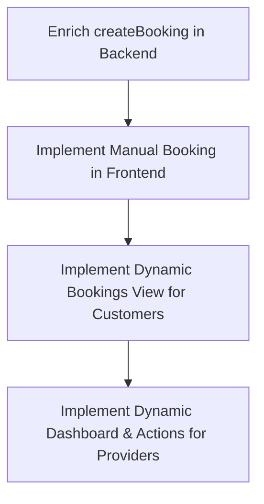

# Wasila AI Booking & Rescheduling System: Implementation Plan

This document details the architecture and step-by-step plan to implement a fully dynamic service booking, rescheduling, and provider approval system for the Wasila platform.

## 1. Database Schema (Firestore)

Bookings will be persisted in a `bookings` collection. Each booking document will contain the following fields:

```typescript
interface Booking {
  id?: string;
  userId: string;          // Customer's User UID
  userName: string;        // Customer's display name
  userPhotoURL: string;    // Customer's avatar URL
  serviceId: string;       // ID of the booked service (from services collection)
  serviceName: string;     // Name of the service (e.g. AC Repair)
  category: string;        // Service category (e.g. Repair, Plumbing)
  price: number;           // Price of the service
  providerId: string;      // Service provider's User UID
  providerName: string;    // Service provider's name
  providerPhotoURL: string;// Service provider's avatar URL
  status: 'pending' | 'accepted' | 'declined' | 'completed' | 'rescheduled';
  date: string;            // Scheduled date/time (e.g. "Tomorrow, 10:00 AM")
  timestamp: string;       // ISO timestamp when booking was created/modified
  notes?: string;          // Extra details or conversation history notes
}
```

---

## 2. Implementation Steps



### Step 1: Enrich Backend Booking Creation (`WasilaADK/src/firebase.ts`)
- Currently, the backend `createBooking` only saves `userId`, `providerId`, and `status`.
- We will modify `createBooking` to:
  1. Retrieve the service details from `services/{serviceDocId}`.
  2. Retrieve user details (customer name/avatar) if available (or default to "Guest").
  3. Save a fully enriched booking document to the `bookings` collection containing both customer and provider details.

### Step 2: Implement Manual Booking in Frontend (`Wasila/src/app/service/[id].tsx`)
- Bind the **"Book Now"** button to a handler.
- When clicked:
  1. Ask for confirmation via `Alert.alert`.
  2. Create a document in the `bookings` collection in Firestore with the current logged-in customer's ID and the service's provider details.
  3. Show a success message and navigate to the `Bookings` tab.

### Step 3: Implement Dynamic Customer Bookings Screen (`Wasila/src/app/(tabs)/bookings.tsx`)
- Replace the hardcoded `BOOKINGS` array with a real-time Firestore query:
  - Query `bookings` where `userId == auth.currentUser.uid`.
- Implement **Reschedule** action:
  - Open a sleek, custom modal (or standard text prompt) to let the customer input a new date/time.
  - Update the booking's `status` to `'rescheduled'` and `date` to the new value in Firestore.
- Implement **Cancel** action:
  - Update status to `'declined'` or delete the booking.

### Step 4: Implement Dynamic Provider Dashboard (`Wasila/src/app/(tabs)/index.tsx`)
- Replace hardcoded statistics and lists with real-time Firestore queries:
  - Query `bookings` where `providerId == auth.currentUser.uid`.
- Filter bookings dynamically into:
  - **New Requests** (Status: `'pending'` or `'rescheduled'`)
  - **Ongoing Tasks** (Status: `'accepted'`)
- Implement actions:
  - **Accept Job**: Updates status to `'accepted'`.
  - **Decline Job**: Updates status to `'declined'`.
  - **Complete Job**: Updates status to `'completed'`.
- Calculate dashboard stats (earnings, job count) dynamically based on completed and accepted bookings.

---

## 3. Real-World Constraints & Safety
- **State Preservation:** Using `onSnapshot` ensures that the UI updates instantly without requiring app or server restarts.
- **Security:** Modifying rules is not required since the Firestore security rules are already open (`match /bookings/{document=**} { allow read, write; }`).
- **No Emojis & Roman Urdu:** Agent responses will remain professional and natural.
