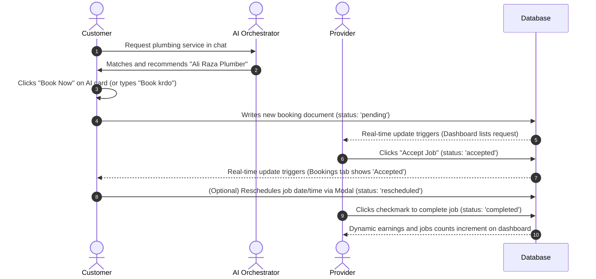

# Wasila AI Service Booking & Management System

This document summarizes the changes, features, and workflows implemented to establish a fully dynamic, end-to-end booking and provider management system across the Wasila platform.

## 1. Dynamic Features Implemented

| Feature | Description | File(s) Modified |
| :--- | :--- | :--- |
| **Manual Booking** | Wired up the **"Book Now"** button in `ServiceDetailScreen`. It prompts for confirmation, creates a `'pending'` booking document in Firestore, and redirects to the Bookings tab. | [\[id\].tsx](file:///c:/Users/Mohammad%20Ahmad/.gemini/antigravity/scratch/Wasila-/Wasila/src/app/service/%5Bid%5D.tsx) |
| **Agent Booking Enrichment** | Updated backend booking engine to fetch customer details (`users` collection) and service details (`services` collection) to create a fully detailed record. | [firebase.ts](file:///c:/Users/Mohammad%20Ahmad/.gemini/antigravity/scratch/Wasila-/WasilaADK/src/firebase.ts) |
| **Customer Bookings Tab** | Subscribes in real-time to the `bookings` collection for the customer's UID. Displays category-styled booking cards dynamically instead of using hardcoded mock lists. | [bookings.tsx](file:///c:/Users/Mohammad%20Ahmad/.gemini/antigravity/scratch/Wasila-/Wasila/src/app/%28tabs%29/bookings.tsx) |
| **Rescheduling & Cancellation** | Allows customers to reschedule booking times using a custom premium modal, or cancel them (updates status to `'declined'`). | [bookings.tsx](file:///c:/Users/Mohammad%20Ahmad/.gemini/antigravity/scratch/Wasila-/Wasila/src/app/%28tabs%29/bookings.tsx) |
| **Provider Dashboard Overview** | Displays earnings (sum of completed jobs), job counts, and pending requests in real-time by querying the bookings database. | [index.tsx](file:///c:/Users/Mohammad%20Ahmad/.gemini/antigravity/scratch/Wasila-/Wasila/src/app/%28tabs%29/index.tsx) |
| **Provider Actions** | Allows providers to accept (status `'accepted'`), decline (status `'declined'`), or complete (status `'completed'`) booking requests in real-time. | [index.tsx](file:///c:/Users/Mohammad%20Ahmad/.gemini/antigravity/scratch/Wasila-/Wasila/src/app/%28tabs%29/index.tsx) |
| **Chat Match Card Booking** | Wired the recommendation card's "Book Now" button in the AI chat screen to create bookings. Passed `userId` to the chat API to prevent orphan guest bookings. | [chat.tsx](file:///c:/Users/Mohammad%20Ahmad/.gemini/antigravity/scratch/Wasila-/Wasila/src/app/%28tabs%29/chat.tsx) |

---

## 2. Dynamic Workflow Overview



---

## 3. How to Test and Verify

### A. Testing the Agent Booking Flow
A test script has been created to simulate a two-step conversational booking flow:
```bash
# In c:\Users\Mohammad Ahmad\.gemini\antigravity\scratch\Wasila-\WasilaADK
npx tsx test-booking-agent.ts
```
**Expected Output:**
1. Step 1 matches a plumber (`Provide 1`).
2. Step 2 creates the booking. The server log outputs:
   `[Firebase Helper] Inserting booking doc: { userId: '...', serviceName: 'Pluming Tab repairing ', price: 1500, providerName: 'Provide 1', status: 'pending' ... }`

### B. Verification in Frontend App
1. Open the Wasila app on Expo.
2. Sign in as a **Customer**:
   * Navigate to a service, click **Book Now**, confirm, and you'll be redirected to the Bookings tab.
   * Verify the booking shows up as `'Pending'`.
   * Try **Reschedule**; type a new time, click save, and verify it updates to `'Rescheduled'` instantly.
3. Sign in as a **Service Provider**:
   * Verify the **New Requests** count increments and shows the booking with the customer name and rescheduled tag.
   * Click **Accept Job**; verify the request moves down to **Ongoing Tasks**.
   * Click the checkmark to mark it **Completed**; verify your **Earnings** and **Jobs** count increments.
