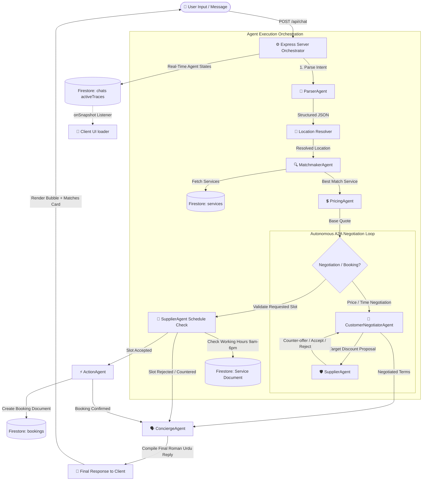

# Wasila Multi-Agent Orchestration Architecture

This document provides a visual diagram and explanation of the multi-agent architecture in the Wasila system. It outlines how individual agents interact, how state is managed, and how the autonomous Agent-to-Agent (A2A) negotiation loop and schedule validation checks are executed.

---

## 📊 System Interaction Workflow

The following flowchart illustrates the complete lifecycle of a chat request, from the user's mobile client down to the database actions and AI concierge reply:

---

## 🛠️ Roles of individual Agents

| Agent Name | Primary Responsibility | Input Parameters | Output Format |
| :--- | :--- | :--- | :--- |
| **ParserAgent** | Extracts structured intents, service category, user location, proposed price, and target booking dateTime. | Raw user message & session history context | Structured JSON intent payload |
| **MatchmakerAgent** | Queries Firestore, matches service categories, and enforces strict location rules to find local service providers. | Resolved Category, Target Location, Provider List | Match success/failure & `bestMatch` payload |
| **PricingAgent** | Computes the service pricing model, factoring in base rate, distance fees, urgency surcharges, and discount thresholds. | Base price, user query, location | Detailed pricing quote summary |
| **CustomerNegotiatorAgent** | Represents the customer's budget interests, opening bids with smart discounts (15-20% off) and countering supplier bids. | Initial quote, negotiation history | Customer counter-proposal bid |
| **SupplierAgent** | Evaluates bids and schedules on behalf of the service provider against working hours, holiday rules, and base price limits. | Provider guidelines, proposal, history | Action decision (Accept / Reject / Counter) |
| **ActionAgent** | Executes database mutations, creating and writing booking documents to Firestore with negotiated prices. | Service ID, User ID, Date/Time, Negotiated Price | Booking success payload & confirmation ID |
| **ConciergeAgent** | Compiles the final natural language response in friendly Roman Urdu, summarizing negotiation wins and booking updates. | Current state, match payload, history | Conversational response text |

---

## ⏱️ Real-Time Trace Broadcasting

While the server is orchestrating the workflow, it calls `pushAndBroadcastTrace()` at every step. This updates the **`chats/{sessionId}`** document in Firestore:

1. **ParserAgent** (`running` ➡️ `done`): Parses user intent.
2. **MatchmakerAgent** (`running` ➡️ `done`): Finds local matching providers.
3. **PricingAgent** (`running` ➡️ `done`): Calculates quote structures.
4. **SupplierAgent** (`running` ➡️ `done`): Runs negotiation loops & checks working hours.
5. **ActionAgent** (`running` ➡️ `done`): Saves the bookings.
6. **ConciergeAgent** (`running` ➡️ `done`): Synthesizes reply.

The client app listens to this document via an `onSnapshot` listener and displays the status of each agent dynamically on the screen before rendering the final message block.
